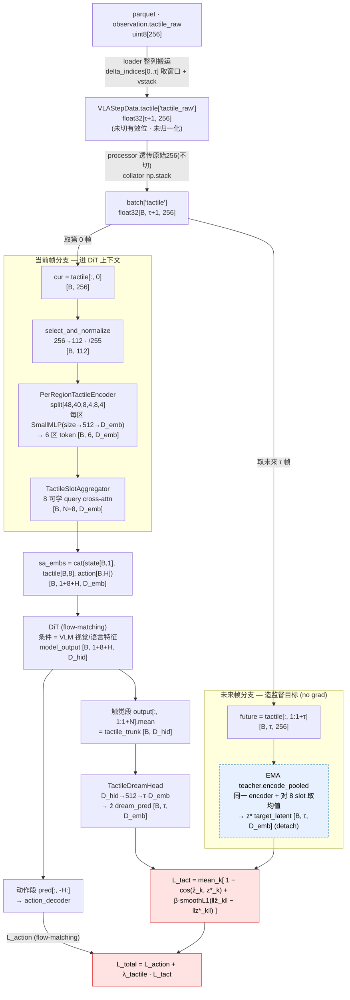

# 1.Training

## 1.1 modify configs

gr00t/configs/data/embodiment_configs.py #line70

## 1.2 launch training
```bash
tmux new -s tactile_ft

export NUM_GPUS=4
export CUDA_VISIBLE_DEVICES=0,1,2,3

uv run torchrun --nproc_per_node=4 --master_port=29500 \
    gr00t/experiment/launch_finetune.py \
    --base-model-path nvidia/GR00T-N1.7-3B \
    --dataset-path data/carry-bucket-stereo \
    --embodiment-tag UNITREE_G1_SONIC \
    --modality-config-path gr00t/configs/data/embodiment_configs.py \
    --num-gpus $NUM_GPUS \
    --output-dir outputs/tactile_no \
    --save-total-limit 1 \
    --save-steps 10000 \
    --max-steps 20000 \
    --use-wandb \
    --global-batch-size 32 \
    --color-jitter-params brightness 0.3 contrast 0.4 saturation 0.5 hue 0.08 \
    --dataloader-num-workers 4 \
    --use-tactile \
    --tactile-encoder-type cnn \
    --tactile-cnn-coord
```

# 2. tactile flow graph

> 符号：B=batch，τ=`dream_horizon`(默认4)，τ+1=`delta_indices` 取的帧数(当前1 + 未来τ)，
> N=`n_tactile_tokens`(默认8)，H=action_horizon，
> **D_emb=`input_embedding_dim`**(token 宽，进 sa_embs / DiT 序列；图中 1536)，
> **D_hid=`hidden_size`**(DiT 主干隐藏宽 / DiT 输出特征宽)，512=`tactile_hidden_dim`(MLP 中间宽)。


